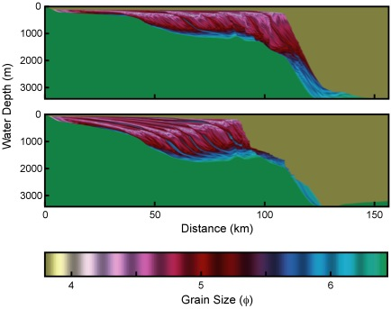

.. sedflux documentation master file, created by
   sphinx-quickstart on Tue Aug 25 12:23:10 2015.
   You can adapt this file completely to your liking, but it should at least
   contain the root `toctree` directive.

Welcome to sedflux's documentation!
===================================

*Sedflux-2.0* is the newest version of the *Sedflux* basin-filling model.
*Sedflux-2.0* provides a framework within which individual process-response
models of disparate time and space resolutions communicate with one another to
deliver multi grain sized sediment load across a continental margin.  Version
2.0 introduces a series of new process models, and the ability to operate in
one of two modes to track the evolution of stratigraphy in either two or three
dimensions.  Additions to the 2D-mode include the addition of models that
simulate:

 * erosion and deposition of sediment along a riverbed,
 * cross-shore transport due to ocean waves, and
 * turbidity currents and hyperpycnal flows.

New processes in the 3D-mode include:

 * river channel avulsion,
 * two-dimensional diffusion due to ocean storms, and
 * two-dimensional flexure due to sediment loading.

The spatial resolution of the architecture is typically 1-25 cm in the
vertical, and 10-100 m in the horizontal when operating in 2D-mode.  In
3D-mode, the horizontal resolution usually extends to kilometers.  In addition
to fixed time steps (from days to hundreds of years), *Sedflux-2.0* offers
event-based time stepping as a way to conduct long-term simulations while still
modeling low-frequency but high-energy events.

Starting Points
===============

You may want to start with one of the following links:
 * :ref:`Checkout <getting_sedflux>` a version of sedflux
 * Download and :ref:`install <installing_sedflux>` sedflux
 * :ref:`Create <sedflux_input_files>` a sedflux simulation and :ref:`run it <sedflux_command_line>`.
 * :ref:`Look at sedflux output <visualize_sedflux>`
 * sedflux process :ref:`modules <sedflux_processes>`

Contents
========

 .. toctree::
  :maxdepth: 2

  devel
  files
  modules
  run
  vis
