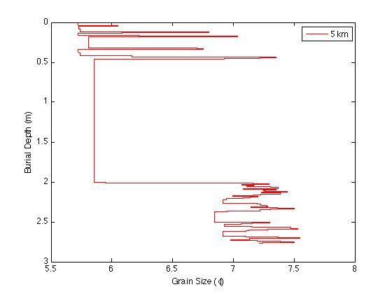
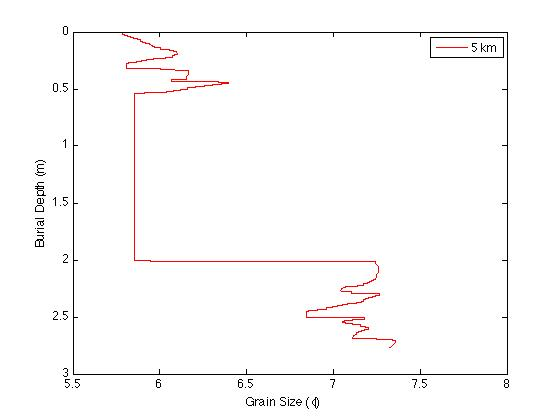

.. _sedflux_module_bioturbation:

Description of the bioturbation module
======================================

sedflux implements one of two bioturbation modules.  The first is
diffusion-based while the second is a biological *conveyor-belt*.  Both
models are described in Boudreau, 1997.

Boudreau, B.P., 1997, Diagenetic Models and Their Implementation: Modelling Trasport and reactions in Aquatic Sediments: Berlin, Springer-Verlag, 414 pp.

Bioturbation as diffusion
-------------------------

The sediment column is divided into a series of layers.  Organisms in the
sediment are assumed to move sediment randomly either up or down.  This
results in the reworking of sediment being a diffusive process.  Thus, for
some sediment layer,

.. math::

  \frac{du_i}{dt} = {d \over dz} \left( K {du_i \over dz} \right)

where :math:`t` is time, :math:`z` is burial depth, :math:`K` is the
biological diffusion coefficient, and :math:`u_i` is the amount of sediment
from the :math:`i`-th layer.  This processes is carried out for each sediment
layer within some burial depth.  Typically, this depth is around 10cm.
Measured biological diffusion coefficients range from 10-100 :math:`cm^2/year`.

Bioturbation as a conveyor belt
-------------------------------

In the conveyor-belt model, organisms move sediment from some depth and
deposit it on the sea floor.  Such a model is known as a non-local model
as sediment jumps from one location to another.  The current implementation
of this model assumes a constant burial depth from which sediment is moved
from and that it is transported at a constant rate, :math:`R`.  Thus,  over
a period of :math:`Dt`, this process will mix an amount of sediment given by,

.. math::

  Dh = R Dt

Typically, :math:`R` is given in units of cm/day and is on the order of 1.

Example
=======

As a control, we deposit 20 years worth of sediment using a simulated daily
time series of sediment discharge from the Eel River, California.  The initial
bathymetry is a linear slope that approximates the Eel River shelf.  We
then run the same simulation with the only difference being that
bioturbation (diffusion) turned on (:math:`K=50 \rm{cm}^2 / \rm{y}`).  The following figures
compare the grain-size profiles for the control (left figure) and diffusion
(right figure) experiment.

.. image:: _static/eel-bioturbation-off.jpg
  :width: 300px

.. image:: _static/eel-bioturbation-diffusion.jpg
  :width: 300px

.. image:: _static/eel-bioturbation-conveyor.jpg
  :width: 300px

For further comparison, the following figures show grain size cores taken
at y=5km for the same two simulations.

.. image:: _static/eel-core-bioturbation-conveyor.jpg
  :width: 300px
