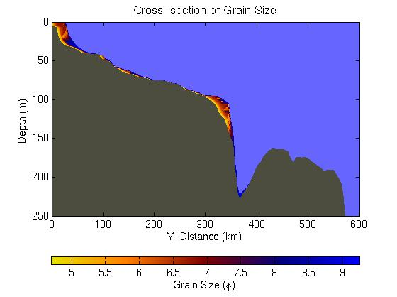
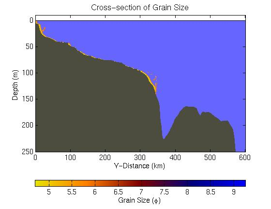

.. _visualize_sedflux:

Visualizing sedflux Output
==========================

There are two main sedflux output files: a property file, and a measuring
station file.  Both can be visualized with Matlab mfiles located in the
`sedflux-mfiles <https://github.com/mcflugen/sedflux-mfiles>`_ GitHub
repository.

Sedflux Property File
---------------------

Sedflux property files are those generated by the Data Dump processes
specified in the process file.  For sedflux2D these are stratigraphic
cross-sections that record properties such as grain size, age, and bulk
density.  For sedflux3D, these files describe data cubes.  These files can be
plotted in Matlab with the sedflux plot_property function.

sedflux2D: plot_property
++++++++++++++++++++++++

For our first example, we consided a property file of average grain size that
was generated by sedflux run in 2D-mode.  For the simulation called,
`sedflux_2D_simulation`, we can use the following to look at some output,

.. code-block:: matlab

  >> plot_property ('sedflux_2D_Simulation0001.grain');

If all goes well, MATLAB should generate an image of the average grain size
over the profile.

Following the name of the file, the user can specify a series of
parameter/value pairs that control how the image is displayed.  For instance,
the following parameter/value pairs print the time (in years), scale the data
between 2 and 10 (phe units), and remove the colorbar.

.. code-block:: matlab

  >> plot_property ('sedflux_2D_Simulation0001.grain' , 'time' , 21000 , 'clim' , [2 10] , 'colorbar' , false);

.. image:: _static/adriatic-x-section-time.jpg
  :width: 400px
  :alt: Sedflux property file

Other parameters are *func*, and *mask*.  Use func to specify a function handle
that will operate on the property data.  The function should take a matrix as
its only input parameter.  Continuing with the previous example, we can plot
grain size in millimeters rather than phe units using the func parameter.

.. code-block:: matlab

  >> plot_property ('sedflux_2D_Simulation0001.grain' , 'func' , @(f)(2.^(-f)));

A data mask is a matrix of logical values that is the same size as the data to
be plotted.  To create a mask, one usually reads in the data and then creates
the mask based on those data values.  This requires the MATLAB function
read_property (explained later).  In the following example, we wish to only
plot those data between 2 and 6 phe units.

.. code-block:: matlab

  >> [f,h] = read_property ('sedflux_2D_Simulation0001.grain');
  >> plot_property ('sedflux_2D_Simulation0001.grain' , 'mask' , f>2 & f<6);

sedflux3D: plot_property
++++++++++++++++++++++++

The following MATLAB command plots a slice of sedflux 3D cube.  In this example
we plot a slice of grain size along the plane at x=3.2km.  One can also specify
a slice of constant y or z (use 'yslice' or 'zslice', respectively).

.. code-block:: matlab

  >> plot_property ('sedflux_3D_Simulation0001.grain' , 'xslice' , 3.2);

.. image:: _static/x-section-3d-property.jpg
  :width: 400px
  :alt: Sedflux property file
